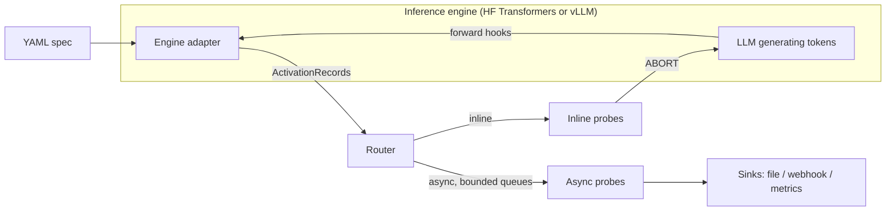

<p align="center">
  <picture>
    <source media="(prefers-color-scheme: dark)" srcset="https://raw.githubusercontent.com/wrynx/undercurrent/main/docs/assets/brand/undercurrent-logo-dark.png">
    
  </picture>
</p>

<p align="center"><em>See the undercurrent before it surfaces.</em></p>

[](https://pypi.org/project/undercurrent/)
[](https://pypi.org/project/undercurrent/)
[](https://github.com/wrynx/undercurrent/actions/workflows/ci.yml)
[](https://github.com/wrynx/undercurrent/blob/main/LICENSE)
[](https://wrynx.github.io/undercurrent/)
[](https://colab.research.google.com/github/wrynx/undercurrent/blob/main/notebooks/quickstart.ipynb)

<sub>An open-source project by [Wrynx](https://github.com/wrynx).</sub>

Undercurrent is production-grade activation probing for live LLM inference.
It runs your probes on a model's internal activations *while it generates*,
so a probe can stop a generation mid-flight, or observe asynchronously
without adding latency to the response.

## Why Undercurrent

- **Declarative YAML specs.** A few lines say which tensor to capture, at
  which layers and token positions, and which probe receives it. No model
  surgery, no forked serving code.
- **Inline abort mid-generation.** An inline probe runs on the generation path
  and can stop a request before the next token is produced.
- **Production-ready async execution.** Observe-only probes run off the hot
  path on bounded per-binding queues with overflow policies, and report to
  metrics and to file or webhook sinks (with retries, dead-lettering and
  redaction).
- **Runs where your model runs.** Inside your existing vLLM deployment, with
  continuous batching (the vLLM adapter is experimental, see
  [Deploy with vLLM](https://wrynx.github.io/undercurrent/guides/vllm-deployment/)),
  and with Hugging Face Transformers on a laptop CPU.

> **Known issues (v0.1):** the vLLM adapter is experimental: its GPU tests
> pass on an NVIDIA L4 with vLLM 0.28.0, run by hand (there's no GPU CI yet),
> and only vLLM 0.28 is supported. Fixed in 0.1.0: on vLLM, `residual_stream`
> on Llama-family (fused-residual) models is captured as
> `hidden_states + residual`, the same residual stream as the HF backend
> (GPU-verified). See
> [Known issues](https://wrynx.github.io/undercurrent/compatibility/#known-issues-v01).

## How it works

In short: an engine adapter (Hugging Face or vLLM) captures the activations your
YAML spec asks for, and the router hands them to your probes, which either
abort the generation (inline) or report to sinks and metrics (async).



## Install

```bash
pip install undercurrent
```

Python 3.10+. The Hugging Face Transformers backend is included; there are no
extras to choose. For vLLM, install Undercurrent into your existing vLLM
environment or image, or use `pip install "undercurrent[vllm]"` to get a vLLM
from the tested range (currently `vllm>=0.28,<0.29`). The adapter checks the
installed vLLM version at runtime; set `UNDERCURRENT_ALLOW_UNSUPPORTED_VLLM=1`
to try an untested vLLM anyway.

Supported versions, tested combinations and known issues are on the
[Compatibility](https://wrynx.github.io/undercurrent/compatibility/) page.

## Quickstart

Attach a probe to GPT-2 and read its result. This runs on CPU:

```python
from undercurrent.core import ActivationRecord, probe
from undercurrent.model import ProbedModel

SPEC = """
version: "1"
extraction_points:
  - name: last_prompt_token
    layers: 6
    tensor_type: residual_stream
    position: "prompt[-1]"
    probe_type: norm_gate
    probe_kind: single_shot
    execution_mode: inline
"""


@probe("norm_gate", threshold=500.0)
def norm_gate(record: ActivationRecord) -> float:
    """L2 norm of the residual stream at this token."""
    return float(record.tensor.norm())


with ProbedModel.from_pretrained("openai-community/gpt2", spec=SPEC, probes={"norm_gate": norm_gate}) as model:
    out = model.generate("The quick brown fox", max_new_tokens=20, temperature=0)

print(repr(out.text))
print(out.probe_results["last_prompt_token"].verdict)
```

A score at or above `threshold` would abort the generation. The
[Quickstart](https://wrynx.github.io/undercurrent/getting-started/quickstart/)
continues with a trajectory probe that stops a generation part-way through,
and an async probe that logs to a file without touching the response.

## How it compares

| | Undercurrent | TransformerLens / pyvene / baukit | nnsight (+ NDIF) | Llama Guard / NeMo Guardrails |
|---|---|---|---|---|
| Purpose | Production activation probing | Interpretability research | Interpretability research, local or remote | Text-level safety classification and rails |
| Runs inside vLLM serving | partial (single worker validated) | ✗ | ✓ | n/a (separate model / wraps the LLM call) |
| Abort a request mid-generation from a probe | ✓ | partial (edit activations; no built-in abort) | partial (edit activations; no built-in abort) | Llama Guard: n/a (application decides); NeMo: partial (streaming rails end the stream, in text chunks) |
| Declarative spec | ✓ YAML | pyvene: partial (dict configs); others ✗ | ✗ | NeMo: ✓ (YAML + Colang) |
| License | Apache-2.0 | MIT / Apache-2.0 / MIT | MIT | Llama 4 Community License / Apache-2.0 |

Last reviewed: 2026-10-01. Footnotes, sources and when to pick something else:
[full comparison](https://wrynx.github.io/undercurrent/comparison/).

## Documentation

- [Quickstart](https://wrynx.github.io/undercurrent/getting-started/quickstart/): your first probe on GPT-2, in five minutes.
- [Concepts](https://wrynx.github.io/undercurrent/concepts/architecture/): extraction points, position selectors, probes, inline vs async.
- [Guides](https://wrynx.github.io/undercurrent/guides/custom-probe/): write, test and package your own probe.
- [Production](https://wrynx.github.io/undercurrent/guides/vllm-deployment/): vLLM deployment, embedding the router, backpressure, sinks and metrics.
- [Examples](https://wrynx.github.io/undercurrent/examples/): complete, runnable projects.
- [API reference](https://wrynx.github.io/undercurrent/reference/): every public class and function, and the CLI.
- [Intended use and limitations](https://wrynx.github.io/undercurrent/about/intended-use/) and [privacy and data handling](https://wrynx.github.io/undercurrent/about/privacy/): what Undercurrent is and isn't for, and what data it captures and writes.
- [Colab notebook](https://colab.research.google.com/github/wrynx/undercurrent/blob/main/notebooks/quickstart.ipynb): the quickstart in your browser.

[`examples/content_safety/`](https://github.com/wrynx/undercurrent/tree/main/examples/content_safety)
is a demo of the wiring (probes, specs and a vLLM pipeline), not a safety
product. Its probes use random-initialised or dummy weights.

## Project status

Undercurrent is on 0.x: the API may change between minor releases. The
[API stability policy](https://github.com/wrynx/undercurrent/blob/main/docs/api-stability.md)
says what is public, what is experimental, and how deprecations work. Planned
work is in the [roadmap](https://github.com/wrynx/undercurrent/blob/main/ROADMAP.md).

## Contributing and community

- [Contributing guide](https://github.com/wrynx/undercurrent/blob/main/CONTRIBUTING.md)
- [Security policy](https://github.com/wrynx/undercurrent/blob/main/SECURITY.md): report vulnerabilities privately to security@wrynx.com.
- [Code of Conduct](https://github.com/wrynx/undercurrent/blob/main/CODE_OF_CONDUCT.md)

## Citation

If you use Undercurrent in research, please cite it using
[`CITATION.cff`](https://github.com/wrynx/undercurrent/blob/main/CITATION.cff)
(GitHub's "Cite this repository" button reads it).

## License

Apache-2.0. See [LICENSE](https://github.com/wrynx/undercurrent/blob/main/LICENSE)
and [NOTICE](https://github.com/wrynx/undercurrent/blob/main/NOTICE). Copyright Wrynx.
