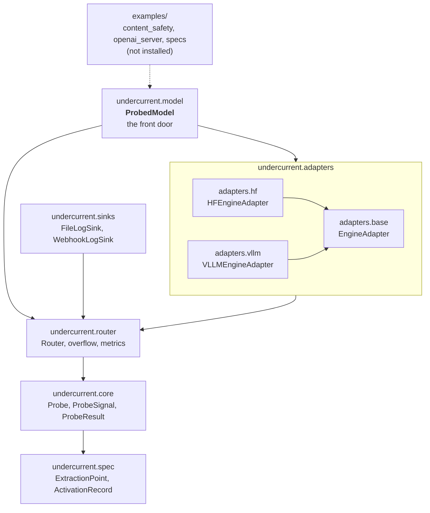

# Architecture

<!-- owner: p3-concepts -->

Undercurrent reads a model's internal activations while it generates text,
hands them to small programs called **probes**, and lets those probes either
report what they saw or stop the generation. This page shows the pieces that
make that happen and how a single request flows through them.

## The pieces

Undercurrent ships as one Python package, `undercurrent`, made of a few
layered subpackages. Each layer only depends on the layers below it.



| Subpackage | What it owns | Depends on |
| --- | --- | --- |
| `undercurrent.spec` | The extraction-point contract: what to capture, where, and with which probe. YAML parsing, validation, [position selectors](position-selectors.md), and the runtime `ActivationRecord`. No engine imports. | pydantic, PyYAML |
| `undercurrent.core` | The [probe interface](probes.md): `Probe`, its lifecycle and isolation model, and the `ProbeSignal` / `ProbeResult` types. | `spec` |
| `undercurrent.router` | Dispatches each activation to the right probe instance for its request, [inline or async](execution-modes.md). Bounded queues, worker pool, [intervention policies](interventions.md), circuit breaker, metrics. | `spec`, `core` |
| `undercurrent.sinks` | Out-of-band observation logging for async probes: NDJSON files and webhooks with retry and dead-lettering. | `core`, `router` |
| `undercurrent.adapters` | `EngineAdapter` (the contract every engine implements), plus the Hugging Face `transformers` and vLLM adapters. They hook the model, build `ActivationRecord`s and call the router. | `spec`, `core`, `router` |
| `undercurrent.model` | `ProbedModel`, the high-level API: load a model, attach probes, generate. | everything above |

`examples/` sits outside the package. It holds runnable demos (a content-safety
pipeline, an OpenAI-compatible reference server, example specs) that are tested
in CI but not installed by `pip install undercurrent`.

Most users only touch `ProbedModel` and write probes. The router, sinks and
metrics are the **advanced** API for embedding Undercurrent in your own serving
stack; see [Embed in your serving stack](../production/embedding.md).

## How a request flows

```mermaid
sequenceDiagram
    participant App as Your code / ProbedModel
    participant Ad as Engine adapter
    participant R as Router
    participant P as Probe instance
    participant S as Log sink

    App->>Ad: register_extraction(request_id, extraction_points)
    App->>Ad: generate(request_id, prompt, kwargs, router)
    Ad->>R: register_request(request_id, extraction_points, ctx)
    R->>P: spawn() + on_start(ctx)
    loop every token x layer that matches an extraction point
        Ad->>R: route(ActivationRecord)
        alt inline
            R->>P: on_activation(record)
            P-->>R: ProbeSignal or None
            R-->>Ad: ProbeSignal or None
            Note over Ad: action=abort stops generation
        else async
            R--)P: enqueue; worker thread calls on_activation
            P--)S: write_signal(...)
            R-->>Ad: None (immediately)
        end
    end
    Ad->>R: end_request(request_id)
    R->>P: drain queue, then on_end(ctx)
    P-->>R: ProbeResult
    R--)S: write_result(...) (async points)
    R-->>App: {extraction_point_name: ProbeResult}
    Ad-->>App: generated text
```

1. **Spec.** You describe what to capture as a list of
   [extraction points](extraction-points.md): which layers, which tensor, at
   which token positions, and which probe gets the data.
2. **Adapter.** The engine adapter installs forward hooks on the model and
   registers the request with the router (`register_request`, which spawns one
   fresh probe instance per extraction point). For every token and layer that matches an extraction point, it builds an
   `ActivationRecord` (request id, extraction point name, layer, token
   position, tensor type, the tensor itself) and calls `router.route(record)`.
3. **Router.** The router looks up the probe instance registered for that
   request and extraction point. An **inline** point calls the probe
   synchronously and returns its `ProbeSignal` to the adapter. An **async**
   point drops the record onto a bounded queue and returns `None` straight
   away, so generation never waits.
4. **Probe.** The probe's `on_activation` turns the activation into an
   optional `ProbeSignal` (`continue`, `flag` or `abort`). When the request
   ends, `on_end` returns exactly one `ProbeResult` with the probe's verdict.
5. **Outcome.** An inline `abort` makes the adapter stop generating. Async
   signals and results go to an attached [log sink](../guides/observation-sinks.md).
   When generation finishes (normally or by abort) the adapter calls
   `end_request`, which drains any queued async work and returns every
   probe's `ProbeResult`.

## The same flow without a model

Because the router only sees `ActivationRecord`s, you can drive the whole
pipeline with synthetic data. This is also how Undercurrent's own tests work.

```python
from undercurrent.core import Probe, ProbeAction, ProbeFactory, ProbeResult, ProbeSignal, RequestContext
from undercurrent.router import Router
from undercurrent.spec import (
    ActivationRecord,
    ExecutionMode,
    ExtractionPoint,
    ProbeKind,
    TensorType,
    parse_position,
)


class MeanThresholdProbe(Probe):
    """Aborts when the mean of an activation exceeds a threshold."""

    probe_kind = "single_shot"

    def __init__(self, threshold: float = 0.5) -> None:
        super().__init__()
        self.threshold = threshold
        self.score = None

    def on_start(self, request_ctx):
        pass

    def on_activation(self, record):
        self.score = sum(record.tensor) / len(record.tensor)
        action = ProbeAction.ABORT if self.score > self.threshold else ProbeAction.CONTINUE
        return ProbeSignal(action=action, confidence=self.score)

    def on_end(self, request_ctx):
        return ProbeResult(self.request_id, self.extraction_point_name, verdict={"score": self.score})


point = ExtractionPoint(
    name="last_prompt_token",
    layers=(6,),
    tensor_type=TensorType.RESIDUAL_STREAM,
    position=parse_position("prompt[-1]"),
    stride=None,
    until=None,
    probe_type="mean_threshold",
    probe_kind=ProbeKind.SINGLE_SHOT,
    execution_mode=ExecutionMode.INLINE,
    queue_depth=None,
)

router = Router(probe_registry={"mean_threshold": ProbeFactory(MeanThresholdProbe, {"threshold": 0.5})})
router.register_request("req-1", [point], RequestContext("req-1", {}, point))

# What an engine adapter would emit for the last prompt token at layer 6:
record = ActivationRecord(
    request_id="req-1",
    extraction_point_name="last_prompt_token",
    layer=6,
    token_pos=11,
    tensor_type="residual_stream",
    tensor=[0.9, 0.7, 0.8],
    is_generated=False,
)
signal = router.route(record)
assert signal.action is ProbeAction.ABORT  # the adapter would stop generating here

results = router.end_request("req-1")
print(results["last_prompt_token"].verdict)  # {'score': 0.79999...}
router.shutdown()
```

With a real model, the adapter emits the records and `ProbedModel` wires up
the router for you. Start with the [Quickstart](../getting-started/quickstart.md),
then read the rest of this section in order:
[extraction points](extraction-points.md) →
[position selectors](position-selectors.md) → [probes](probes.md) →
[execution modes](execution-modes.md) → [interventions](interventions.md).

## Engine adapters

An adapter implements four methods from `undercurrent.adapters.base.EngineAdapter`:

| Method | What it does |
| --- | --- |
| `load_model(model_name_or_path, **kwargs)` | Load the engine. Engine-specific kwargs pass through. |
| `register_extraction(request_id, extraction_points)` | Set up capture for one request before it generates. Must not affect other requests. |
| `generate(request_id, prompt, generation_kwargs, router)` | Generate, calling `router.route()` for every matching activation and stopping on an inline `abort`. |
| `unregister_extraction(request_id)` | Tear down that request's capture state. |

The two shipped adapters differ mainly in how they schedule work, which
affects how quickly an abort takes effect and whether blocking interventions
are safe:

| | `adapters.hf` (`HFEngineAdapter`) | `adapters.vllm` (`VLLMEngineAdapter`) |
| --- | --- | --- |
| Execution | One sequential `generate()` loop, one request at a time | Continuous batching, many concurrent requests |
| Abort takes effect | Before the next token | At the next scheduler step (expect a few extra tokens) |
| `block_until_signal` | Safe: the wait only affects this request | Stalls every request in the batch; avoid under concurrency |
| Tensor types | `residual_stream`, `attn_out`, `mlp_out` | `residual_stream`, `attn_out`, `mlp_out`, `final_norm` |

See [Interventions](interventions.md) for the details, and
[The vLLM adapter](../internals/vllm-adapter.md) for how the vLLM adapter maps
batched rows back to requests.

## Where to go next

- API details: [`undercurrent.spec`](../reference/spec.md),
  [`undercurrent.core`](../reference/core.md),
  [`undercurrent.router`](../reference/router.md),
  [`undercurrent.sinks`](../reference/sinks.md),
  [`undercurrent.adapters`](../reference/adapters.md),
  [`undercurrent.model`](../reference/model.md).
- Writing your own probe: [Write a custom probe](../guides/custom-probe.md).
