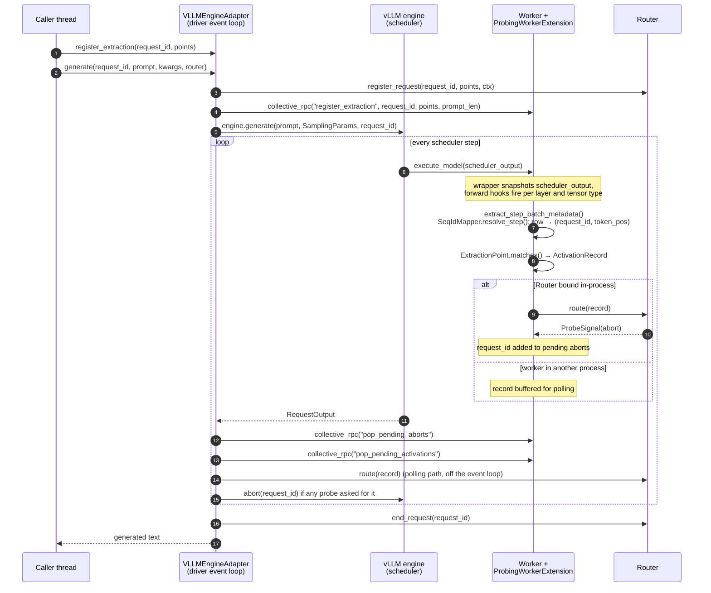

# The vLLM adapter

<!-- owner: p3-vllm-internals-page -->

This page explains how `undercurrent.adapters.vllm` captures activations inside
vLLM, maps them back to requests and token positions, and stops a request when a
probe tells it to. It's for people who want to trust the integration, debug it,
or extend it. To deploy it, see [Deploy with vLLM](../guides/vllm-deployment.md).
For the vLLM versions it's tested against, see [Compatibility](../compatibility.md).

## Summary

`VLLMEngineAdapter` drives vLLM's async engine and installs a *worker extension*,
`ProbingWorkerExtension`, into each vLLM worker. The extension puts PyTorch
forward hooks on the model's decoder layers, attention and MLP blocks, and wraps
the model runner's `execute_model` so that it knows which scheduler step is
running. Each scheduler step processes one flattened batch that mixes tokens
from many requests. When a hook fires, the extension reads that step's batch
layout and translates every row of the captured tensor into a
`(request_id, token_pos)` pair (`SeqIdMapper`). Rows that match a registered
`ExtractionPoint` become `ActivationRecord`s and go to `Router.route`. If an
inline probe returns an abort signal, the adapter calls the engine's own
`abort()`, and vLLM stops scheduling the request from the next step on.



The rest of the page goes through each piece in turn.

## The `EngineAdapter` contract

Every engine adapter implements the same engine-agnostic abstract base class,
`undercurrent.adapters.base.EngineAdapter`. `undercurrent.adapters.vllm` also
re-exports it.

```py
class EngineAdapter(ABC):
    def load_model(self, model_name_or_path: str, **kwargs) -> None: ...
    def register_extraction(self, request_id: str, extraction_points: list[ExtractionPoint]) -> None: ...
    def generate(self, request_id: str, prompt: str, generation_kwargs: dict, router: Router) -> str: ...
    def unregister_extraction(self, request_id: str) -> None: ...
```

The contract covers three things: the four method signatures; one
`ActivationRecord` per matching (token, layer); and an inline abort signal
stopping generation as promptly as the engine allows. It doesn't say how
positions are tracked, whether `generate()` drives an async engine underneath,
or how concurrent requests are handled. Those are each adapter's own business,
and the rest of this page is about how the vLLM adapter handles them.

`VLLMEngineAdapter` follows the contract with two vLLM-specific details:

- **Registration completes inside `generate()`.** The worker needs each
  request's prompt length before the first (prefill) step, and the prompt
  isn't tokenized until `generate()` runs. `register_extraction()` stores the
  extraction points on the driver; `generate()` tokenizes the prompt, then
  sends the extraction points and the prompt length to the worker together
  before it submits the request to the engine.
- **A synchronous API over an async engine.** Continuous batching only happens
  when the engine is driven through vLLM's async engine (`AsyncLLMEngine`),
  whose `generate()` is an async generator. `load_model()` starts one
  background event loop on its own thread. Each synchronous `generate()` call
  submits a coroutine to that loop and blocks the *calling* thread until it
  returns. Two threads calling `adapter.generate(...)` at once therefore really
  do share scheduler steps.

`shutdown()` stops the background loop. It isn't part of the base class.

!!! info "Requires a GPU"
    This example needs a CUDA GPU and vLLM.

```py
from undercurrent.adapters.vllm import VLLMEngineAdapter
from undercurrent.router import Router

adapter = VLLMEngineAdapter()
adapter.load_model("gpt2", gpu_memory_utilization=0.3, max_model_len=64, enforce_eager=True)

router = Router(probe_registry=probe_registry)
adapter.register_extraction(request_id, extraction_points)
text = adapter.generate(request_id, prompt, {"max_tokens": 32, "temperature": 0.0}, router)
adapter.unregister_extraction(request_id)

adapter.shutdown()
```

`load_model()` forwards extra keyword arguments to vLLM's `AsyncEngineArgs`. It
sets `worker_extension_cls` itself. The adapter supports exactly one `Router`
for its whole lifetime.

## The core problem: there is no "token position N"

In Hugging Face's `generate()` loop there is one sequence and one tensor per
step, so the token position is just the loop counter. vLLM gives that up:

- Every decoder-layer forward pass works on **one flattened tensor** of shape
  `[total_tokens_in_step, hidden]`. It concatenates whatever mix of prefill
  chunks and single decode tokens the scheduler picked for *this step*, across
  many requests.
- Which rows belong to which request, and at what position in that request's
  sequence, **changes every step**. Requests join and leave the batch
  independently. A finished request's row slot is reused by a newly admitted
  one. Long prompts can be split into chunks across several prefill steps
  before decoding starts.

So the mapping from row to `(request_id, token_pos)` has to be recomputed from
the scheduler's metadata on every step. Two modules do this:

- `undercurrent.adapters.vllm.introspection` reads the live batch layout.
  `extract_step_batch_metadata()` walks the model runner's persistent batch
  (`model_runner.input_batch.req_ids` and `.num_computed_tokens_cpu`) in
  row-slot order. It keeps only the requests that are actually scheduled this
  step (`scheduler_output.num_scheduled_tokens`). The result is a
  `StepBatchMetadata`: request ids, rows per request and tokens already
  computed, all in flattening order.
- `undercurrent.adapters.vllm.seq_mapper` does the translation.
  `SeqIdMapper.resolve_step()` turns a `StepBatchMetadata` into one
  `TokenRowMapping` per row: the row index, the request id, the absolute token
  index (which becomes `ActivationRecord.token_pos`), whether the token is
  generated, and its index within the generated part. `SeqIdMapper` tracks each
  request's prompt length and how many tokens it has generated so far.

`seq_mapper` is pure Python, with no torch or vLLM import. Its unit tests
(`tests/adapters/vllm/test_seq_mapper.py`) cover single-shot prefill, chunked
prefill, decode steps, two requests sharing a step, a reused row slot, and a
request that drops out of the batch for a step and comes back.

Both modules fail loudly. If a scheduled row belongs to a request that was
never registered, `resolve_step()` raises `SeqMapperError` instead of guessing a
prompt length. If the installed vLLM's internals have a different shape,
`check_introspection_compatible()` raises `VLLMIntrospectionError` on the first
step. Silently wrong token positions would be worse than no data.

## Interception: worker extension and forward hooks

There were two ways to get at activations inside vLLM:

- **Worker extension and forward hooks (used).** vLLM's `worker_extension_cls`
  engine argument mixes an extra class into each worker. That class can see the
  model runner and the model, which is an ordinary `torch.nn.Module` graph, and
  it can expose methods the driver calls through `collective_rpc`. The
  extension installs `register_forward_hook` on the decoder layers and their
  submodules.
- **Logits processors (rejected).** A logits processor runs once per request
  per step, *after* the full forward pass, and sees only the final logits. It
  never sees intermediate hidden states, attention output or MLP output, so it
  can't serve `residual_stream`, `attn_out` or `mlp_out` extraction points. A
  logits processor could have carried the abort signal, but the adapter uses
  the engine's `abort()` instead, so captures and aborts share one
  worker-to-driver path.

The extension needs two more pieces besides the hooks themselves:

1. **Per-step metadata.** A forward hook only receives
   `(module, input, output)`; it doesn't know which step is running.
   `ProbingWorkerExtension` wraps the model runner's `execute_model` method
   (`_install_execute_model_wrapper()`) so that it keeps the step's
   `scheduler_output` while the step runs. The first hook that fires in a step
   builds the `StepBatchMetadata` and the row mappings; the other hooks in that
   step reuse them.
2. **A way back to the driver.** The `Router` lives in the driver process, and
   captures happen inside the worker's forward pass. See
   [Process topology](#process-topology).

### What gets hooked

Hooks are installed lazily, the first time a request is registered, because the
model isn't loaded yet when vLLM constructs the extension.
`_find_decoder_layers()` looks for the layer list at `model.model.layers`,
`model.layers` and `model.transformer.h` (GPT-2 style), in that order, and raises
`WorkerExtractionError` if none exists. For each decoder layer it hooks:

| `tensor_type` | Hooked module | Layer index in records |
| --- | --- | --- |
| `residual_stream` | the decoder layer itself | the layer's index |
| `attn_out` | the layer's `self_attn` submodule, if present | the layer's index |
| `mlp_out` | the layer's `mlp` submodule, if present | the layer's index |
| `final_norm` | the model's final norm (`model.model.norm`, `model.norm` or `model.transformer.ln_f`) | number of decoder layers (one past the last) |

So a 32-layer model's final norm is addressed as `layer: 32, tensor: final_norm`.
If a submodule's output is a tuple, `_extract_captured_tensor()` takes its
first tensor. The decoder layer (`residual_stream`) is different: vLLM's
fused-residual layers (Llama, Qwen2, Gemma, ...) return
`(hidden_states, residual)`, where `hidden_states` is the MLP output and
`residual` the stream before it's added; the add is deferred to the next
layer's fused `input_layernorm`. `_residual_stream_from_layer_output()`
captures `hidden_states + residual`, computed out of place in the model's
dtype (vLLM's CUDA fused-add kernel later overwrites both tensors in place).
A single tensor (GPT-2, Granite) or `(hidden_states, None)` is captured as
is, and any other shape of output raises `VLLMAdapterLimitationError`. See
[the fix in 0.1.0](../compatibility.md#fixed-in-010-residual_stream-on-fused-residual-vllm-layers). Each matching row is copied to the CPU as `float32` before it becomes an
`ActivationRecord`. Hooks return early when no registered extraction point
wants that (layer, tensor type), so unused hooks cost little.

Which tensor each hook sees under tensor and pipeline parallelism is covered in
[Tensor & pipeline parallelism](vllm-parallelism.md).

### Engine settings the adapter forces

`load_model()` sets two environment variables before it builds the engine. Each
one has an opt-out keyword argument:

| Setting | Why | Opt out with |
| --- | --- | --- |
| `VLLM_USE_V2_MODEL_RUNNER=0` | `introspection` only understands the V1 model runner's batch layout. Some vLLM setups pick the V2 runner by default. | `allow_v2_model_runner=True` |
| `VLLM_DISABLE_REQUEST_ID_RANDOMIZATION=1` | Some vLLM versions append a random suffix to the `request_id` you pass in. The scheduler would then report an id that was never registered. | `allow_request_id_randomization=True` |

If you opt out, capture fails loudly on the first hook (`VLLMIntrospectionError`
or `SeqMapperError`); it doesn't mis-map silently.

## Process topology

`collective_rpc()` only goes one way: the driver calls a method on the worker
and waits for its result. The worker can't push data to the driver whenever it
likes. That matters because captures happen inside the worker's forward pass,
and inline extraction points need `route()`'s answer to decide whether to abort.
The adapter has two paths and picks one per adapter lifetime, the first time
`generate()` runs (`_ensure_router_bound()`):

**In-process path.** The adapter calls `bind_router` over `collective_rpc`. If
the worker runs in the driver's own process, the worker gets a direct reference
to the live `Router`, and `_emit()` calls `router.route(record)` synchronously
from inside the forward hook. An inline abort decision is available at once.

**Polling path.** On some vLLM versions, the async engine always runs its engine
core in a subprocess, whatever the executor. A live `Router` (with its thread
pool, locks and probe instances) can't be serialized across that boundary, so
the `bind_router` call fails. The adapter logs this and falls back to polling:

- `_emit()` buffers each `ActivationRecord` in the worker.
- After every `RequestOutput`, the adapter calls `pop_pending_activations` over
  `collective_rpc`. Records travel as plain dicts with the tensor as a nested
  list, because vLLM's RPC encoder doesn't handle arbitrary dataclasses or
  tensors nested in ad-hoc structures.
- `_drain_pending_activations()` rebuilds the `ActivationRecord`s in the driver
  and routes them **in capture order**, one at a time, through
  `run_in_executor`. Order matters for trajectory probes, and running routing
  off the event loop stops a slow probe from stalling every other in-flight
  request's traffic with the engine.

Capture, position matching and row mapping are the same on both paths; only the
place where `route()` runs differs. On the polling path, activations (and the
abort decisions that depend on them) arrive up to one polling interval late.

For the same reason, `generate()` sends extraction points to the worker as plain
dicts (`extraction_point_to_dict()`), and the worker parses them back with
`undercurrent.spec.parse_dict()`.

### How many workers

`load_model()` counts workers by making a harmless `pop_pending_aborts` call:
`collective_rpc` returns one result per worker. With more than one worker (for
example tensor or pipeline parallelism), it raises `VLLMAdapterLimitationError`
unless you pass `allow_unsupported_executor=True`. It also raises if the probe
call itself fails. With the override, the adapter merges every worker's
results; see [Tensor & pipeline parallelism](vllm-parallelism.md) for what that
does and doesn't cover.

## Aborts and interventions

When an inline probe returns `ProbeSignal(action="abort")`, the abort reaches
the engine in one of two ways:

- **In-process path:** `_emit()` sees the signal from `route()` and adds the
  request id to the worker's pending-aborts set. After each `RequestOutput`,
  `_drain_pending_aborts()` collects the set with `pop_pending_aborts` and calls
  the engine's `abort(request_id)`.
- **Polling path:** `_drain_pending_activations()` gets the signal from its own
  `route()` call in the driver and calls `abort(request_id)` straight away.

Async extraction points never abort: for them `Router.route()` queues the record
and returns `None`.

**Timing.** vLLM schedules a whole step, possibly covering many requests, before
it checks for aborted requests while building the *next* step. Calling `abort()`
can't recall tokens already dispatched in the step whose activation triggered
it. The earliest a request stops is the start of the next scheduler iteration.
A sequential HF loop can check a stopping criterion before every token; here,
expect at least one extra token past the triggering step, and possibly a few
under heavy concurrent load. The GPU integration test checks that an aborted
request stops well short of `max_tokens`, not that it stops at an exact token.

### `block_until_signal` and continuous batching

For an inline extraction point with `intervention.mode: block_until_signal`,
`Router.route()` waits up to `timeout_ms` for the probe and substitutes the
`on_timeout` fallback if it runs out (see
[Intervention policies & timeouts](../production/intervention-policies.md)). The
adapter doesn't change that, and the hook never waits longer than `timeout_ms`.

What the adapter can't change is *what* waits. On the in-process path the hook
runs on vLLM's shared engine thread, during a step that batches tokens from many
requests. A bounded wait there stalls the whole step, so every other request in
the batch waits too, not only the one whose activation triggered the probe. With
the HF adapter, one decode step is the whole engine for one request, so the
blocking scope is exactly what you asked for. Under continuous batching it widens
to the batch. No adapter-level fix exists: making one row of a batched forward
pass wait means blocking the whole call.

`register_extraction()` logs a one-time warning per worker the first time it
sees an extraction point with `mode: block_until_signal`. A router-wide
`default_intervention_policy` of `block_until_signal` has the same effect, but
the worker only sees extraction points, not the router's resolved policy, so it
can't warn about that case.

**Recommendation:** use `block_until_signal` with vLLM only for single-request
or effectively unbatched deployments. With real concurrent batching, use the
default `mode: reject`, or `execution_mode: async` for observe-only probes. See
[Execution modes](../concepts/execution-modes.md).

## Running under `vllm serve`

Everything above is the *embedded* path: you construct `VLLMEngineAdapter` and
it builds the engine. Undercurrent also registers a `vllm.general_plugins` entry
point, `undercurrent.adapters.vllm.plugin:register`, which vLLM loads
automatically in every process a `vllm serve` invocation starts (API server,
engine core and each worker). Here's what the current code does on that route:

- **The plugin does not install the worker extension.** vLLM calls the plugin
  with no arguments and never passes it a config to change, so it can't set
  `worker_extension_cls`. You have to pass it yourself:

    ```bash
    vllm serve <model> \
      --worker-extension-cls undercurrent.adapters.vllm.worker_extension.ProbingWorkerExtension
    ```

- **The plugin applies the same correctness settings as `load_model()`**, but
  only where they're unset (`VLLM_USE_V2_MODEL_RUNNER=0`,
  `VLLM_DISABLE_REQUEST_ID_RANDOMIZATION=1`), so an explicit value in your
  environment wins. It also logs once per process that it loaded, with a
  reminder about `--worker-extension-cls`.
- **Nothing drives capture.** The extension only installs hooks and captures for
  requests registered through its `register_extraction` RPC, and only hands
  records over when someone calls `pop_pending_activations`.
  `VLLMEngineAdapter.generate()` makes those calls; a bare `vllm serve` process
  has nothing that does. In Undercurrent v0.1 this route gives you a
  correctly configured engine with the extension loaded, but not end-to-end
  probing.

For HTTP serving with probes today, embed `VLLMEngineAdapter` in your own
server. [`examples/openai_server/`](https://github.com/wrynx/undercurrent/tree/main/examples/openai_server)
is a working reference.

## Known limitations

These all fail loudly unless the table says otherwise.

| Limitation | Impact | Workaround | Tracked in |
| --- | --- | --- | --- |
| More than one worker (tensor or pipeline parallelism, Ray) isn't validated. | `load_model()` raises `VLLMAdapterLimitationError`. | `allow_unsupported_executor=True`. Results from all workers are merged and deduplicated, but this is unvalidated. | [Tensor & pipeline parallelism](vllm-parallelism.md) |
| `residual_stream` needs to recognise the decoder layer's output: a single tensor, `(hidden_states, None)`, or a fused-residual `(hidden_states, residual)` pair of matching shape and dtype (captured as their sum). | Any other output (for example HunYuan's 3-tuple) raises `VLLMAdapterLimitationError` when a `residual_stream` extraction point fires on it. GPU verification of the fused-residual sum against the HF backend is pending `scripts/gpu_check.sh`. | Use `attn_out`, `mlp_out` or `final_norm`, or the HF backend, on such models. | [Compatibility](../compatibility.md#fixed-in-010-residual_stream-on-fused-residual-vllm-layers) |
| `attn_out` is only hooked when the layer has a `self_attn` submodule. vLLM's GPT-2 implementation names it `attn`. | **Silent.** `attn_out` extraction points never fire on GPT-2-style models. | Use `residual_stream` or `mlp_out` on those models. | Future work |
| Only tested with `enforce_eager=True`. The adapter doesn't set it. | With CUDA graphs, replayed steps run recorded GPU kernels without executing Python, so forward hooks can't fire during them. | Pass `enforce_eager=True` to `load_model()`, as the tests and examples do. | Future work |
| `tensor: kv` is rejected. The KV cache lives in paged blocks addressed through a slot mapping, not in a per-step tensor with one row per token. | `register_extraction` raises `WorkerExtractionError`. | Use `residual_stream`, `attn_out`, `mlp_out` or `final_norm`. | Future work |
| Negative-indexed single-point selectors (`generated[-1]`) never match. Resolving them needs the request's final length, which vLLM only knows once the request finishes, and by then the step's activations are gone. | **Silent.** No records for those extraction points. | `generated[*]` and slices (`generated[5:]`, `generated[2:8]`) work. Keep the last record from a trajectory probe yourself. | Future work |
| `block_until_signal` stalls every request in the batch, not only the triggering one. | Higher latency for co-batched requests, up to `timeout_ms` per blocked step. | Use `mode: reject` or `execution_mode: async` under concurrency. | By design (see [above](#block_until_signal-and-continuous-batching)) |
| An abort takes effect at the next scheduler step. | At least one extra token after the triggering step, more under load. | None; account for it in the probe. | By design |
| On the polling path, `route()` runs once per polling interval in the driver. | Activations and abort decisions lag by up to one step. | None needed for correctness; it happens automatically when the worker isn't in the driver's process. | By design |
| `introspection` reads undocumented vLLM internals (`input_batch.req_ids`, `num_computed_tokens_cpu`, `scheduler_output.num_scheduled_tokens`), and `execute_model` is wrapped by replacing a method on the model runner instance. | A vLLM release can change them. The [runtime version check](../compatibility.md#the-runtime-vllm-version-check) and `check_introspection_compatible()` fail fast. | Use a [tested vLLM version](../compatibility.md). | [Compatibility](../compatibility.md) |
| Only vLLM's V1 model runner is supported. | `load_model()` forces V1. With `allow_v2_model_runner=True`, capture fails with `VLLMIntrospectionError`. | Keep the default. | Future work |
| Stable request ids depend on `VLLM_DISABLE_REQUEST_ID_RANDOMIZATION`, which vLLM marks as deprecated. | If a future vLLM removes the flag, the adapter can't map rows to requests on that version. | Use a [tested vLLM version](../compatibility.md). | Future work |
| A bare `vllm serve` process doesn't capture anything (see [above](#running-under-vllm-serve)). | No probing over vLLM's built-in HTTP server. | Embed `VLLMEngineAdapter`; see [`examples/openai_server/`](https://github.com/wrynx/undercurrent/tree/main/examples/openai_server). | Future work: a built-in OpenAI-compatible server |
| Decoder-layer and final-norm discovery only knows three attribute paths. | No decoder layers found: `WorkerExtractionError`. No final norm found: **silent**, `final_norm` points never fire. | Add the model's path to `_find_decoder_layers()` / `_find_final_norm()` in `undercurrent/adapters/vllm/worker_extension.py`. | — |

## Testing

The unit tests in `tests/adapters/vllm/` run without a GPU or vLLM:

- `test_seq_mapper.py`: the row-to-position translation, against hand-built
  `StepBatchMetadata`.
- `test_worker_extension_bookkeeping.py`: registration, `kv` rejection, hook
  installation on a fake model, layer discovery, and the activation buffer.
- `test_worker_extension_capture.py`: hook firing through row mapping,
  `ActivationRecord`, `Router.route()` and the abort signal, using a fake model
  runner and a minimal fake `torch` module. It includes two requests in one step and the polling path.
- `test_adapter_contract.py`: call ordering, the version-dependent RPC
  fallbacks, router binding, merging results from several workers, and
  `_drain_pending_activations()`.
- `test_plugin.py` and `test_version_check.py`: the `vllm serve` plugin and the
  version check.

`test_integration_vllm.py` needs a CUDA GPU and vLLM, and skips cleanly
otherwise. It covers a single-shot extraction point, a `generated[*]`
trajectory, the same trajectory with a second concurrent request in flight, and
an inline abort.

```bash
pip install -e ".[dev]"
python -m pytest tests/adapters/vllm
```
