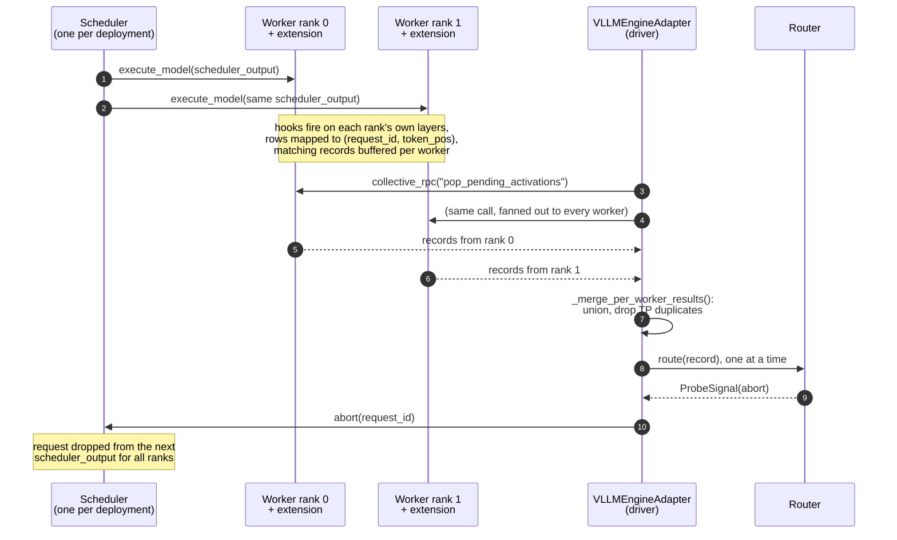

# Tensor & pipeline parallelism

<!-- owner: p3-vllm-internals-page -->

This page covers what happens to activation capture when vLLM spreads a model
over several GPUs with tensor parallelism (TP), pipeline parallelism (PP), or
both. Read [The vLLM adapter](vllm-adapter.md) first; this page builds on it.
The vLLM source details below were checked against the vLLM version listed in
[Compatibility](../compatibility.md) and may change in other releases.

## Summary

Multi-worker topologies are **not validated** in Undercurrent v0.1:
`VLLMEngineAdapter.load_model()` raises `VLLMAdapterLimitationError` when vLLM
starts more than one worker, unless you pass `allow_unsupported_executor=True`.
The capture side is sound for stock Llama-style models. Under TP, every rank's
hook sees the same full, already all-reduced tensor. Under PP, each rank's hooks
fire only for the layers that rank owns. With more than one worker, every worker
runs its own `ProbingWorkerExtension` in its own process, so the adapter always
uses the polling path: after each step it collects buffered records from every
worker, merges them, drops TP duplicates, and routes them in the driver. An
abort goes to vLLM's single, central scheduler, which stops scheduling the
request on every rank from the next step.



## What the adapter hooks

All hooks are `register_forward_hook` calls, so they fire **after** the hooked
module's `forward()` has returned, and they see whatever it returned.

| `tensor_type` | Hooked module (Llama naming) |
| --- | --- |
| `residual_stream` | the decoder layer (`LlamaDecoderLayer`) |
| `attn_out` | the layer's `self_attn` (`LlamaAttention`) |
| `mlp_out` | the layer's `mlp` (`LlamaMLP`) |
| `final_norm` | the model's final norm (`RMSNorm`) |

See [What gets hooked](vllm-adapter.md#what-gets-hooked) for how modules are
found and which element of a tuple output is captured.

## Tensor parallelism

Under TP, each rank holds a slice of every weight matrix. The question is
whether a hook on one rank sees a partial result or the full tensor.

### Row-parallel layers all-reduce inside `forward()`

vLLM's `RowParallelLinear.forward()` (in `vllm.model_executor.layers.linear`)
reduces its result across TP ranks before it returns:

```py
def forward(self, input_):
    ...
    output_parallel = self.quant_method.apply(self, input_parallel, bias_)
    if self.reduce_results and self.tp_size > 1:
        output = tensor_model_parallel_all_reduce(output_parallel)  # all-reduce here
    else:
        output = output_parallel
    ...
    return output, output_bias
```

The all-reduce is a statement *inside* `forward()`, and its result is what gets
returned. A forward hook fires only after `forward()` returns, so no hook, on
the linear layer or on any module that calls it, can see the pre-reduce
`output_parallel`. The question isn't which submodule the hook is on; it's
whether `reduce_results` is `True` for the row-parallel layer. By the time any
hook fires, the reduce has finished.

### `attn_out`

`LlamaAttention` builds its output projection as
`o_proj = RowParallelLinear(...)` without passing `reduce_results`, so it takes
the default, `True`. `LlamaAttention.forward()` ends with:

```py
attn_output = self.attn(q, k, v)
output, _ = self.o_proj(attn_output)  # o_proj has already all-reduced
return output
```

**`attn_out` is the full tensor, identical on every TP rank.** A hook on `o_proj`
itself would see the same thing.

### `mlp_out`

`LlamaMLP` builds `down_proj = RowParallelLinear(..., reduce_results=reduce_results)`
with `reduce_results` defaulting to `True`, and `LlamaDecoderLayer` constructs
its `mlp` without overriding it. **`mlp_out` is the full tensor, identical on
every TP rank**, for the same reason.

!!! warning "This depends on `reduce_results=True`"
    Nothing in vLLM stops a model implementation or quantization path from
    building `o_proj` or `down_proj` with `reduce_results=False`, for example to
    defer the reduce to a later fused kernel. The plain Llama path doesn't do
    this, but check it for each architecture (including MoE and fused-kernel
    variants) before trusting `attn_out` or `mlp_out` under TP.

### `residual_stream`

`LlamaDecoderLayer.forward()`:

```py
hidden_states = self.self_attn(positions=positions, hidden_states=hidden_states)
hidden_states, residual = self.post_attention_layernorm(hidden_states, residual)
hidden_states = self.mlp(hidden_states)
return hidden_states, residual
```

By the time this returns, `self_attn` and `mlp` have produced full outputs, and
the norms and residual adds are elementwise operations over the full hidden
dimension with no sharding. Every TP rank holds complete `hidden_states` and
`residual` tensors throughout. **`residual_stream` is the full tensor on every
TP rank, whatever the TP size.**

The layer returns a `(hidden_states, residual)` tuple, and the adapter
captures `hidden_states + residual`, the residual stream after the layer (see
[the fix in 0.1.0](../compatibility.md#fixed-in-010-residual_stream-on-fused-residual-vllm-layers)).
Both tensors are replicated, complete `[tokens, hidden]` tensors on every TP
rank: `hidden_states` comes out of `down_proj`'s all-reduce and `residual` is
built from elementwise adds of all-reduced tensors. So the sum needs no
gather and is the same on every rank.

This assumes eager execution (`enforce_eager=True`, which the adapter needs
anyway; see [Known limitations](vllm-adapter.md#known-limitations)). vLLM's
sequence-parallelism compilation pass (`pass_config.enable_sp`) rewrites the
compiled graph so the residual is split across TP ranks by token, and it
doesn't apply in eager mode. If a pair's shapes ever disagree, the adapter
raises `VLLMAdapterLimitationError` rather than summing.

### `final_norm`

`LlamaModel` creates a real `RMSNorm` only on the last PP rank:

```py
if get_pp_group().is_last_rank:
    self.norm = RMSNorm(config.hidden_size, eps=config.rms_norm_eps)
else:
    self.norm = PPMissingLayer()
```

`RMSNorm` isn't sharded across TP ranks. **`final_norm` is the full tensor on
every TP rank of the last pipeline stage.**

### TP summary

| `tensor_type` | Hooked module | Full tensor under TP? |
| --- | --- | --- |
| `residual_stream` | decoder layer | Yes. Nothing is sharded at this point in the graph. |
| `attn_out` | `self_attn` | Yes, as long as `o_proj` keeps the default `reduce_results=True`. |
| `mlp_out` | `mlp` | Yes, as long as `down_proj` keeps the default `reduce_results=True`. |
| `final_norm` | final `RMSNorm` | Yes. Only present on the last PP stage. |

### Duplicate records across TP ranks

Since every TP rank captures the same value, every rank's extension also emits
the same record. The adapter merges per-worker results in
`VLLMEngineAdapter._merge_per_worker_results()` and drops duplicates:

- Activation records are keyed by `(request_id, extraction_point_name, layer,
  token_pos, is_generated)`. The tensor isn't part of the key, because TP
  replicas are identical by construction.
- Pending aborts are deduplicated by request id.

Without this, TP size *N* would route each event *N* times. Deduplication only
applies within one poll. TP ranks run each step together, so their copies of an
event should land in the same poll, but this hasn't been validated on a real
multi-GPU deployment.

The per-step row mapping needs no change for TP. Registration calls fan out to
every worker through `collective_rpc`, so each rank's `SeqIdMapper` knows every
request's prompt length, and each rank receives the same `scheduler_output`.

## Pipeline parallelism

Under PP, each rank owns a contiguous range of decoder layers.

### How layers are assigned

`LlamaModel.__init__` calls `make_layers()` (in
`vllm.model_executor.models.utils`), which asks
`vllm.distributed.utils.get_pp_indices()` for this rank's
`[start_layer, end_layer)` range. The split is even unless the
`VLLM_PP_LAYER_PARTITION` environment variable overrides it. `make_layers()`
then builds the layer list (simplified):

```py
modules = torch.nn.ModuleList(
    [PPMissingLayer() for _ in range(start_layer)]
    + [layer_fn(prefix=f"{prefix}.{idx}") for idx in range(start_layer, end_layer)]
    + [PPMissingLayer() for _ in range(end_layer, num_hidden_layers)]
)
```

Layers outside the rank's range are `PPMissingLayer` placeholders, a subclass of
`torch.nn.Identity`. So `model.model.layers` has `num_hidden_layers` entries on
every rank, but only `[start_layer, end_layer)` holds real decoder layers.
`LlamaModel.forward()` only calls the local range:

```py
for idx, layer in enumerate(islice(self.layers, self.start_layer, self.end_layer)):
    hidden_states, residual = layer(positions, hidden_states, residual, **extra_layer_kwargs)
```

The placeholders are never called. The same goes for the final norm: it's a
placeholder on every rank but the last, and those ranks return intermediate
tensors before they reach it.

### What this means for capture

`ProbingWorkerExtension._find_decoder_layers()` enumerates every entry of the
layer list, placeholders included, and hooks all of them. This is harmless: a
hook only runs when its module's `forward()` runs, and placeholders are never
called. **On each PP rank, hooks fire only for the decoder layers that rank
owns.** An extraction point for `layers: 20` on a rank holding layers 0–15 has a
valid hook that never fires. It doesn't error and doesn't pick up another
layer's data; the record comes from whichever rank owns layer 20.

Because the placeholders keep the list at full length, the final norm's layer
index (the number of decoder layers) is the same on every rank.

At a stage boundary, the last layer a rank owns still returns
`(hidden_states, residual)`. `LlamaModel.forward()` sends both to the next
stage as `IntermediateTensors({"hidden_states": ..., "residual": ...})`
unchanged, and the next stage's first layer folds them together in its fused
`input_layernorm`, exactly as within one rank. So the boundary layer's
`residual_stream` capture (`hidden_states + residual`) is the true stream
after that layer, and the next stage's first layer receives `residual` as an
argument and returns its own pair, so its capture is correct too. The first
layer of stage 0 is called with `residual=None` and sets
`residual = hidden_states` (the embeddings) itself, so it returns the same
kind of pair.

### Merging records from several stages

Each stage contributes records for a disjoint set of layers, so their keys never
collide and `_merge_per_worker_results()` simply unions them. Records from
non-zero ranks aren't dropped.

Ordering across stages is **not guaranteed**. The merged list is built worker
by worker: all of one worker's buffered records, then the next worker's. Within
a single worker, capture order is kept.

This matters because one extraction point can span stages. `layers` accepts a
list, `ExtractionPoint.layers` is a tuple, and the adapter emits one
`ActivationRecord` per matched layer, all routed to the same bound probe. Take
an extraction point with `layers: [5, 20]`, where rank 0 owns layer 5 and rank 1
owns layer 20. If one poll covers two decode steps, the merged list is:

```text
tok1@L5, tok2@L5, tok1@L20, tok2@L20      # what the merge produces today
tok1@L5, tok1@L20, tok2@L5, tok2@L20      # forward-pass order
```

A trajectory probe that accumulates state token by token sees token positions go
1, 2, 1, 2. Under TP alone this never shows up, because duplicates collapse to a
single entry whatever the merge order; it needs ranks that own different layers.

Sorting the merged records by `token_pos` alone isn't enough. It restores
monotonic token order, but layers 5 and 20 share a `token_pos`, so their
relative order would be left to the sort's tiebreak. The right key is
`(token_pos, layer)`, which matches the forward pass (lower layers run first). It
is a no-op for extraction points that touch a single layer, so it doesn't change
behaviour for anything supported today. The sort belongs in
`_drain_pending_activations()`, after merging, not in the deduplication key.
This isn't implemented yet; see [Future work](#future-work).

## Aborts across ranks

### Enforcement needs no extra work

`AsyncLLM.abort()` passes the request ids down to `EngineCore.abort_requests()`,
which tells the scheduler to mark them finished:

```py
def abort_requests(self, request_ids: list[str]):
    """Abort requests from the scheduler."""
    self.scheduler.finish_requests(request_ids, RequestStatus.FINISHED_ABORTED)
```

There's **one** `Scheduler` inside `EngineCore` for the whole deployment, not
one per TP or PP rank. Every step, the executor broadcasts one
`SchedulerOutput`, built from that scheduler's state, to every worker with
`collective_rpc("execute_model", ...)`. Once a request is marked aborted, the
next `SchedulerOutput` leaves it out for every rank and every pipeline stage. No
extra cross-rank signalling is needed. The one-step latency described in
[Aborts and interventions](vllm-adapter.md#aborts-and-interventions) applies
unchanged.

### Getting the abort to the driver

The adapter's job is getting a probe's abort decision to the driver so that it
can call `abort()`. With more than one worker, the in-process path doesn't
apply (each worker is its own process), so the decision is always made in the
driver: `_drain_pending_activations()` routes the merged records and calls
`abort()` for any abort signal, whichever rank captured the activation.
`_drain_pending_aborts()` also merges every worker's pending-abort list rather
than reading only the first worker's.

## Multiple worker processes

TP and PP both need more than one worker: vLLM only picks its single-process
executor when `pipeline_parallel_size * tensor_parallel_size` (times any context
parallelism) is 1, and otherwise defaults to `MultiprocExecutor` or Ray. So every
PP or TP deployment also depends on the adapter behaving correctly with several
worker processes. These are the properties it relies on, and why they hold.

### Each worker process has its own extension state

vLLM applies `worker_extension_cls` inside `WorkerWrapperBase.init_worker()`
(in `vllm.v1.worker.worker_base`) by appending the class to the worker class's
`__bases__`. That runs once in each worker process, against that process's own
copy of the class. `ProbingWorkerExtension` keeps all of its mutable state (the
`SeqIdMapper`, registered requests, pending aborts and pending activations, hook
handles) in instance attributes created by `_ensure_state()`. The only
module-level names in `adapter.py`, `worker_extension.py` and `seq_mapper.py` are
constants and the logger. Workers can't share or overwrite each other's state.

### Draining buffers doesn't race

The adapter drains each worker's buffers with
`collective_rpc("pop_pending_activations")` and
`collective_rpc("pop_pending_aborts")` while the hooks that fill those buffers
run during `execute_model`. Three things keep these from interleaving:

1. **Each worker runs one call at a time.** `WorkerProc.worker_busy_loop()`
   (in `vllm.v1.executor.multiproc_executor`) takes one RPC off its queue, runs
   it to completion, and only then takes the next. A forward pass and a drain on
   the same worker can't overlap.
2. **The engine drains client requests between steps.**
   `EngineCore.run_busy_loop()` calls `_process_input_queue()`, which handles
   every queued request including utility calls such as `collective_rpc`, and
   only then `_process_engine_step()`, which runs the next `execute_model`. Both
   happen on the same thread.
3. **Concurrent polls get their own replies.** With several `generate()` calls
   in flight, each one polls from a coroutine on the adapter's event loop.
   `AsyncMPClient` tags each utility call with its own `call_id` and resolves the
   matching future, so one request's poll can't receive another's reply.

One assumption to keep in mind: `MultiprocExecutor.collective_rpc()` takes no
lock around its enqueue-then-wait sequence. It's safe because only
`EngineCore`'s busy-loop thread calls it. If a vLLM release handled utility
requests on several threads, or the adapter started calling `collective_rpc`
from more than one thread, that would need revisiting.

### Every worker sees the same registration

`register_extraction` and `unregister_extraction` go through `collective_rpc`.
`MultiprocExecutor` writes each call once to a shared-memory broadcast queue
(`MessageQueue` in `vllm.distributed.device_communicators.shm_broadcast`) that
every worker reads its own copy from, so every worker's `SeqIdMapper` receives the
same request id, extraction points and prompt length. The Ray executor gets the
same result by calling the method once on each worker with the same arguments.
Using that registration correctly also needs every rank to resolve the same
batch layout each step, which holds because every rank executes the same
`SchedulerOutput` (see [Aborts across ranks](#aborts-across-ranks)).

### Multi-node and Ray

Neither multi-node deployments nor Ray change anything the adapter can see.

- `MultiprocExecutor` supports more than one node, and it's vLLM's default
  backend for multi-node CUDA deployments unless Ray is requested or already
  running. Only the leader node owns the broadcast queue; replies from workers on
  other nodes come back through bridged response queues. `collective_rpc()`
  keeps the same signature and still returns one result per worker.
- `RayDistributedExecutor.collective_rpc()` (in `vllm.v1.executor.ray_executor`)
  makes one Ray actor call per worker and returns `ray.get()` of those calls,
  also a list with one entry per worker.
- In both, workers load `worker_extension_cls` through the same
  `init_worker()` path, which doesn't depend on the executor or the node.

So `_merge_per_worker_results()` needs no transport-specific handling, and the
ordering gap described in
[Merging records from several stages](#merging-records-from-several-stages)
is the same for both backends. None of this has been run on real hardware, and
vLLM's newer `ray_executor_v2` backend hasn't been checked.

## Support status

| Topology | Capture correct? | What's missing | Status |
| --- | --- | --- | --- |
| Single worker | Yes | — | Supported |
| TP only | Yes for stock Llama-style models (see the `reduce_results` caveat) | Validation on real multi-GPU hardware | Needs `allow_unsupported_executor=True`; not validated |
| PP only | Yes; hooks are inert on stages that don't own the layer | Ordering of records across stages; per-rank layer reporting; validation | Needs `allow_unsupported_executor=True`; not validated |
| TP × PP | Same as above | Everything from both rows | Needs `allow_unsupported_executor=True`; not validated |
| Multi-node (`MultiprocExecutor`) or Ray | Same as the TP/PP rows; the RPC contract the adapter uses is unchanged (from reading the source) | Validation | Needs `allow_unsupported_executor=True`; not validated |

`tensor: kv`, the V2 model runner and negative-indexed single-point selectors are
unsupported in every topology; see
[Known limitations](vllm-adapter.md#known-limitations).

## Future work

In order:

1. **TP with a single pipeline stage.** The capture side and the TP
   deduplication are in place. What's left is GPU validation, starting with
   `residual_stream` and `final_norm` (no per-layer `reduce_results` to check),
   then `attn_out` and `mlp_out` once `reduce_results=True` has been confirmed
   for the quantized and fused-kernel paths in scope.
2. **PP.** Layer routing is deterministic and out-of-range hooks are inert, so
   this is mostly a driver-side problem:
   1. Sort merged activation records by `(token_pos, layer)` in
      `_drain_pending_activations()`, and update
      `_merge_per_worker_results()`'s docstring, which still describes
      cross-rank ordering as open. Without this, an extraction point whose
      layers span stages gets records out of token order.
   2. Unit-test it with a disjoint-layer, interleaved-arrival scenario. Like the
      existing `_merge_per_worker_results()` tests in
      `tests/adapters/vllm/test_adapter_contract.py`, this needs no GPU or vLLM.
   3. Report each rank's `[start_layer, end_layer)` range, either through a
      new RPC or as part of the topology check in `load_model()`, so an
      extraction point aimed at a layer no rank owns shows up as a
      configuration error instead of looking like "no matching token yet."
   4. Run a real PP integration test on multi-GPU hardware (or possibly on one
      GPU with `VLLM_PP_LAYER_PARTITION`, if that turns out to work).
3. **TP × PP.** Once both of the above hold up on their own.
