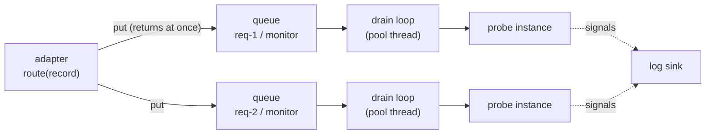

# Async execution & backpressure

<!-- owner: p3-concepts -->

This page is for operators running async probes under real load. It covers how
the router queues and processes async work, what happens when probes fall
behind, how to size things, and how to tell from metrics that you have a
problem. For the idea itself, read
[Execution modes: inline vs async](../concepts/execution-modes.md) first.

## The moving parts

When a request registers, the router creates one **binding** per extraction
point. For an `execution_mode: async` point, the binding owns:

- a fresh **probe instance**, used only by this request and point;
- a **bounded queue** (`BoundedDropQueue`) holding at most `queue_depth`
  activations;
- a **drain loop**: one long-lived task, submitted to the router's shared
  `ThreadPoolExecutor`, that takes activations off the queue one at a time and
  calls `probe.on_activation`.



`route()` for an async point only enqueues and returns `None`. The drain loop
is the queue's only consumer, so each probe instance sees its activations
strictly in the order they were routed, on one thread at a time. A probe
needs no locking for its own state.

The worker threads are real OS threads, not asyncio tasks. Probes are plain
synchronous code that may block (a forward pass on a GPU, a remote call), and
threads keep the router usable from ordinary synchronous adapter code.

### Bindings pin threads

A drain loop holds its pool thread for its binding's **whole lifetime**, from
`register_request` until the request ends, even while its queue is empty. So
the pool size caps how many async bindings can make progress at once:

> concurrently serviced async bindings ≤ `worker_pool_size`

If more async bindings are alive than there are threads, the extra ones wait
for a thread to free up. Their queues still accept activations (applying the
overflow policy when full), but nothing is processed until an earlier request
ends.

`block_until_signal` interventions on inline points run on the **same pool**.
If async drain loops occupy every thread, a blocking intervention's call queues
behind them, times out, and returns its `on_timeout` fallback. Enough of those
in a row trip the [circuit breaker](intervention-policies.md#circuit-breaker).

## Overflow policies

When `route()` finds a binding's queue full, the overflow policy decides:

| Policy | Behaviour | You lose | You pay |
| --- | --- | --- | --- |
| `drop_oldest` (default) | Evict the oldest queued activation, accept the new one | Older activations; the probe sees the most recent window | Nothing on the generation path |
| `drop_newest` | Reject the incoming activation; the queue is unchanged | Newer activations; the probe sees the earliest ones | Nothing on the generation path |
| `block` | `route()` waits until the worker frees a slot | Nothing is dropped | Generation slows to the probe's speed |

How to choose:

- **`drop_oldest`** suits monitoring where recency matters, such as a running
  score over the latest tokens. It is the safe default: the generation path
  never waits.
- **`drop_newest`** suits probes whose interesting signal is early in the
  generation, or that need a contiguous prefix rather than a sampled tail.
- **`block`** suits offline evaluation and data collection, where every
  activation must be processed and throughput matters less than completeness.
  Avoid it in latency-sensitive serving: a slow probe becomes slow generation.
  On vLLM, the blocked `route()` call runs on the shared engine thread, so it
  stalls every request in the batch, not just this one. And if the binding is
  waiting for a pool thread (see above), `block` can stall generation until
  another request ends.

The policy is set router-wide:

```py
from undercurrent.router import OverflowPolicy, Router

router = Router(probe_registry, default_overflow_policy=OverflowPolicy.DROP_NEWEST)
```

There is no `overflow_policy` key in the spec today; every async point on a
router shares the router's policy. A dropped activation is gone for good. The
probe is not told about it, so a trajectory probe's state silently skips those
tokens. Watch the drop count (below).

### Seeing drops happen

This example uses a probe that blocks until released, so the queue fills
deterministically:

```python
import threading

from undercurrent.core import Probe, ProbeFactory, ProbeResult, RequestContext
from undercurrent.router import OverflowPolicy, Router
from undercurrent.spec import ActivationRecord, ExecutionMode, ExtractionPoint, ProbeKind, TensorType, parse_position

started = threading.Event()
release = threading.Event()


class StuckProbe(Probe):
    """Blocks on its first activation until released, then counts the rest."""

    probe_kind = "trajectory"

    def __init__(self):
        super().__init__()
        self.seen = []

    def on_start(self, request_ctx):
        pass

    def on_activation(self, record):
        if not self.seen:
            started.set()
            release.wait()
        self.seen.append(record.token_pos)

    def on_end(self, request_ctx):
        return ProbeResult(self.request_id, self.extraction_point_name, verdict=self.seen)


point = ExtractionPoint(
    name="monitor",
    layers=(0,),
    tensor_type=TensorType.RESIDUAL_STREAM,
    position=parse_position("generated[*]"),
    stride=None,
    until=None,
    probe_type="stuck",
    probe_kind=ProbeKind.TRAJECTORY,
    execution_mode=ExecutionMode.ASYNC,
    queue_depth=2,
)
router = Router(probe_registry={"stuck": ProbeFactory(StuckProbe)}, default_overflow_policy=OverflowPolicy.DROP_OLDEST)
router.register_request("req-1", [point], RequestContext("req-1", {}, None))


def record(pos):
    return ActivationRecord("req-1", "monitor", 0, pos, "residual_stream", [0.0], True)


router.route(record(0))
started.wait()  # the worker is now busy with token 0
for pos in range(1, 6):  # tokens 1..5 arrive while it is stuck
    router.route(record(pos))

snapshot = router.get_metrics("req-1", "monitor")
assert snapshot.queue_depth == 2  # tokens 4 and 5 are waiting
assert snapshot.drop_count == 3  # tokens 1, 2 and 3 were evicted

release.set()
results = router.end_request("req-1")
assert results["monitor"].verdict == [0, 4, 5]
router.shutdown()
```

With `OverflowPolicy.DROP_NEWEST` the probe would have seen `[0, 1, 2]`; with
`OverflowPolicy.BLOCK` the fourth `route()` call would have waited until
`release.set()`.

## Sizing

### `queue_depth`

`queue_depth` is how many activations a binding can buffer while its probe is
busy. It absorbs bursts; it can't fix a probe that is slower than generation
on average.

Think in rates. If generation produces matching activations at *r* per second
for this point (tokens per second × layers in the point ÷ `stride`) and the
probe takes *t* seconds each:

- If *r* × *t* < 1, the probe keeps up. The queue only needs to cover
  bursts, such as the prompt's matches arriving all at once at prefill. A depth
  of a few times the number of layers in the point is usually plenty.
- If *r* × *t* ≥ 1, the probe falls behind on every request and the queue
  will fill sooner or later, whatever its size. Make the probe cheaper, raise
  `stride`, capture fewer layers, or accept drops.

Each queued item holds one activation tensor (a `hidden_dim`-sized CPU tensor
with the shipped adapters), so memory per binding is roughly
`queue_depth × hidden_dim × bytes per element`. That is small per binding, but
multiply by concurrent requests.

Set it per point in the spec (`queue_depth: 64`) or router-wide with
`Router(default_queue_depth=...)`, which applies to async points that don't
set one. The default is 32.

### `worker_pool_size`

The default is `min(32, 4 × CPU count)`. Because each async binding pins a
thread for its request's lifetime, size the pool from concurrency, not cores:

```text
worker_pool_size ≥ (max concurrent requests × async points per request)
                   + headroom for block_until_signal calls
```

For example, a server with up to 16 concurrent requests and 2 async points
each needs at least 32 threads before counting blocking interventions. The
threads mostly sit waiting on a queue or inside probe I/O, so a pool larger
than the core count is normal. If a probe is CPU-heavy pure Python, the GIL
limits real parallelism whatever the pool size; move the heavy work into
PyTorch or NumPy, which release the GIL.

```py
router = Router(probe_registry, worker_pool_size=64, default_queue_depth=64)
```

## End of request and shutdown

### `end_request(request_id)`

`end_request` is the normal way a request finishes. The adapters call it when
generation ends, including after an abort. For each async binding, in turn, it:

1. closes the queue, so no new activations are accepted;
2. waits for the drain loop to process **everything already queued**, for up
   to `drain_timeout` seconds (default 30, set with
   `Router(drain_timeout=...)`). This budget is per binding. Once the queue
   is empty the drain loop exits, freeing its pool thread;
3. calls `probe.on_end` and forwards the `ProbeResult` to the log sink;
4. forgets the binding's metrics.

So queued work is never discarded at the end of a request. The cost is that
`end_request` blocks until the backlog clears. If a binding doesn't drain in
time, the router logs a warning and calls `on_end` anyway. The verdict may then
miss the last activations, and the worker keeps running in the background until
it finishes its backlog.

The request id is removed before draining starts, so a late `route()` for it
raises `RouterError` instead of racing the teardown.

### `shutdown(wait=True | False)`

`shutdown` is for stopping the whole process:

- `shutdown(wait=True)` (default): every still-registered request's async
  queues are drained (per binding, up to `timeout`, defaulting to
  `drain_timeout`), then the pool shuts down.
- `shutdown(wait=False)`: every async queue is cleared immediately and the
  call returns without waiting. An activation already inside `on_activation`
  still runs to completion, since a running thread can't be interrupted.

Either way, requests still registered at shutdown **never get `on_end`** and
produce no `ProbeResult`: there is nowhere to return one. End requests with
`end_request` before shutting down if you need their verdicts. The router
can't be used after `shutdown`.

## Metrics that reveal backpressure

The router keeps per-binding metrics for every async point, always on. Read
them with `router.get_metrics(request_id, extraction_point_name)`, which
returns a `MetricsSnapshot`, or push them to your monitoring system with
`router.attach_metrics_sink(sink)`. Metrics exist only for async bindings and
only while the request is registered. See [Metrics](metrics.md) for wiring a
backend.

| Metric | `MetricsSnapshot` field / `MetricsSink` method | What it tells you |
| --- | --- | --- |
| Queue depth | `queue_depth` / `record_queue_depth` | Items waiting right now. Sitting near `queue_depth` means the probe is behind. |
| Drops | `drop_count` / `record_drop` | Activations discarded by the overflow policy. Any non-zero value means the probe missed data. |
| Activations processed | `activation_count` / `record_activation` | Throughput. Compare with how many activations were routed. |
| Probe latency | `avg_activation_latency_seconds` / `record_activation` (per call) | Time inside `on_activation`. Multiply by the arrival rate to get the *r* × *t* load factor. |
| Probe errors | `error_count` / `record_probe_error` | `on_activation` calls that raised. |

What to alert on:

- **Drops above zero** for a probe whose verdict you rely on: raise
  `queue_depth` if it is a burst problem, otherwise make the probe cheaper.
- **Queue depth pinned at the maximum** with **low `activation_count`**:
  the binding may not have a pool thread at all. Raise `worker_pool_size`.
- **Probe latency trending up**: the load factor is approaching 1, and drops
  will follow.
- **Slow `end_request`**: long drains add to request completion time even
  though generation itself wasn't slowed; time it in your server.

## Related

- [Execution modes: inline vs async](../concepts/execution-modes.md)
- [Observation sinks](../guides/observation-sinks.md): where async signals and results go.
- [Metrics](metrics.md)
- [Embed in your serving stack](embedding.md)
- [`undercurrent.router` API reference](../reference/router.md)
